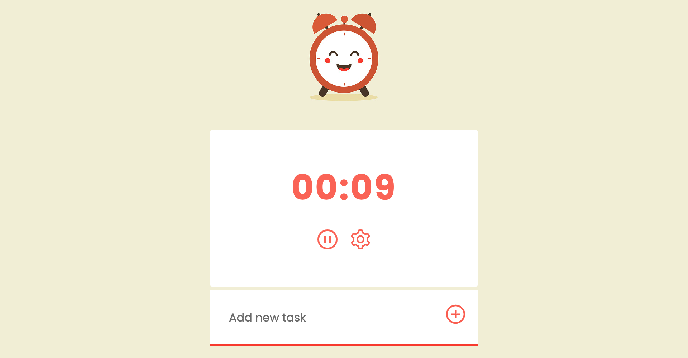
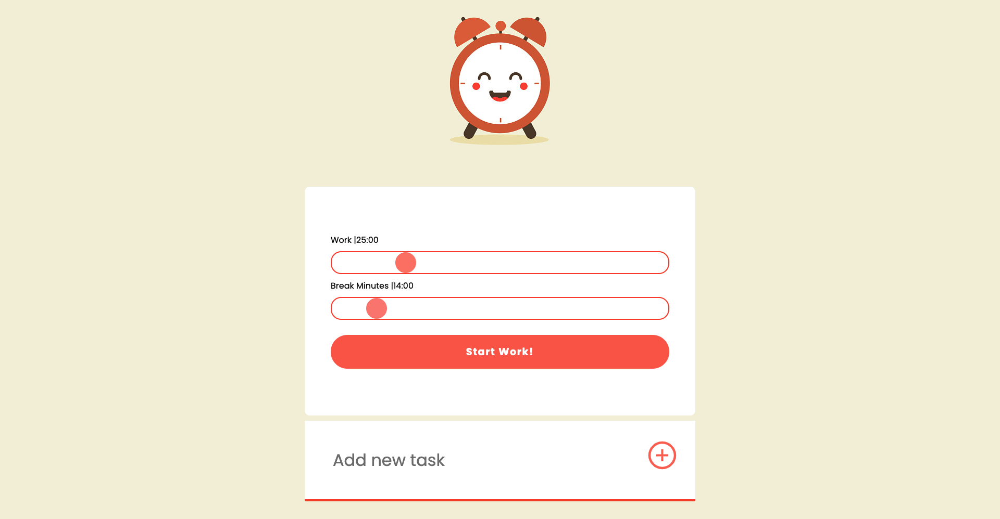
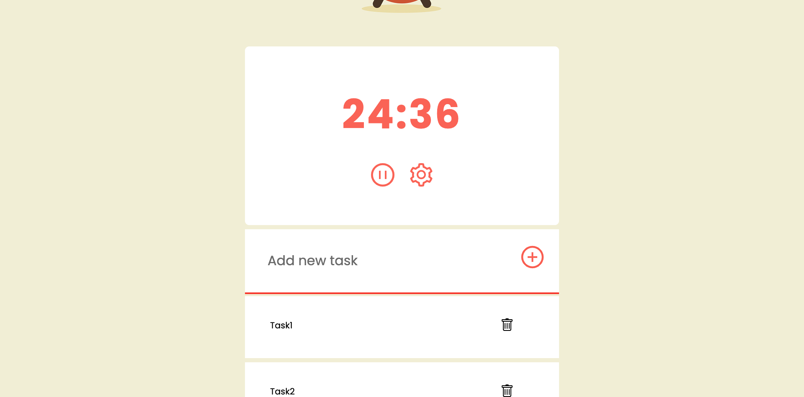
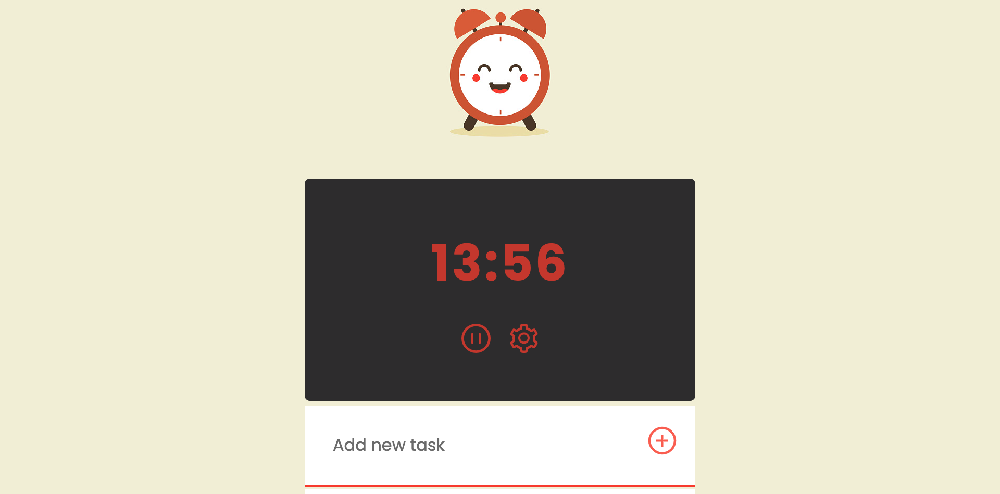

# Pomodoro App With ReactJS ⏰️

## Installation ⚡

<ul>
    <li> 

npm

<pre>
<code>npm install npm@latest -g
</code></pre>
    </li>
    <li>

Clone the repo

<pre>
<code>git clone https://github.com/esrasen9/pomodoro-app</code>
</pre>
<li>

Install npm packages

<pre>
<code>npm install</code>
</pre>
</li>
</ul>

# Screenshots :camera_flash:

